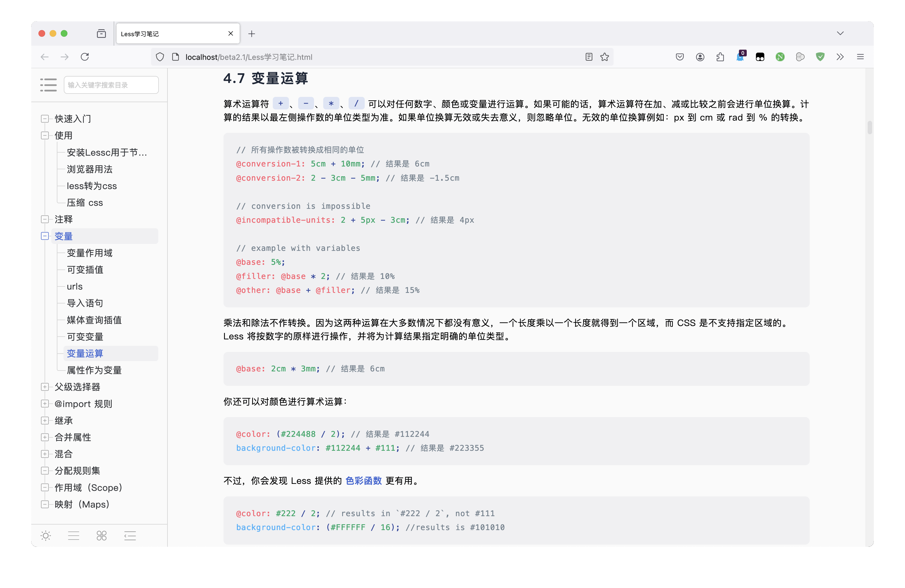
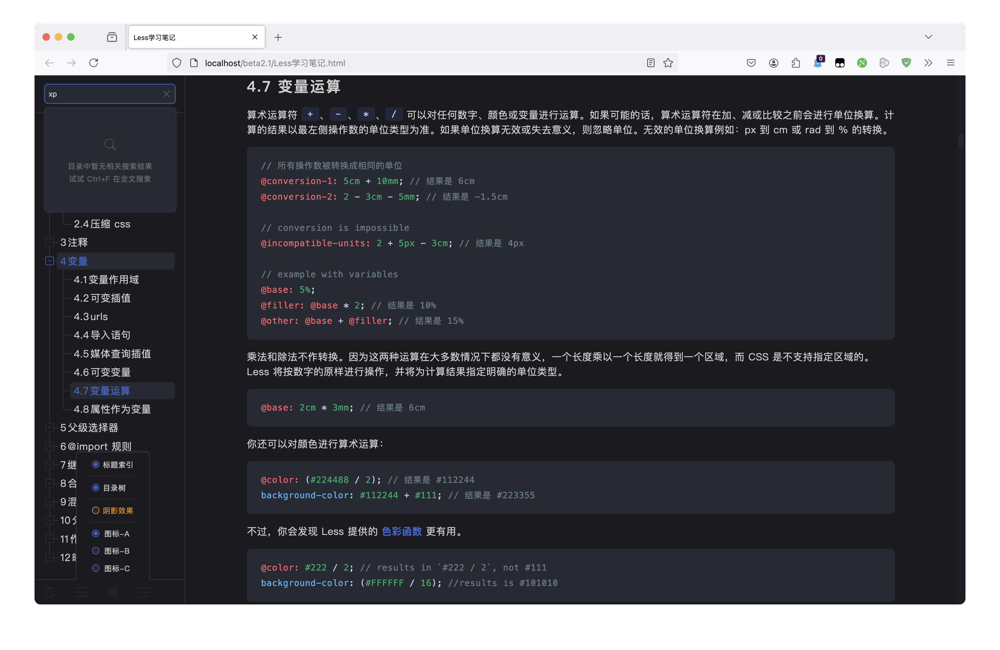
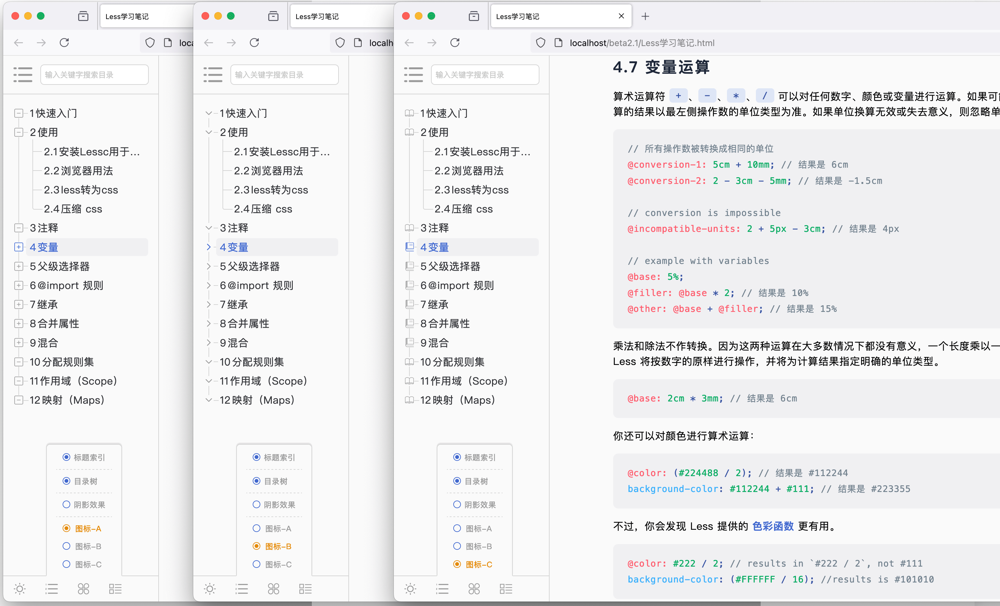
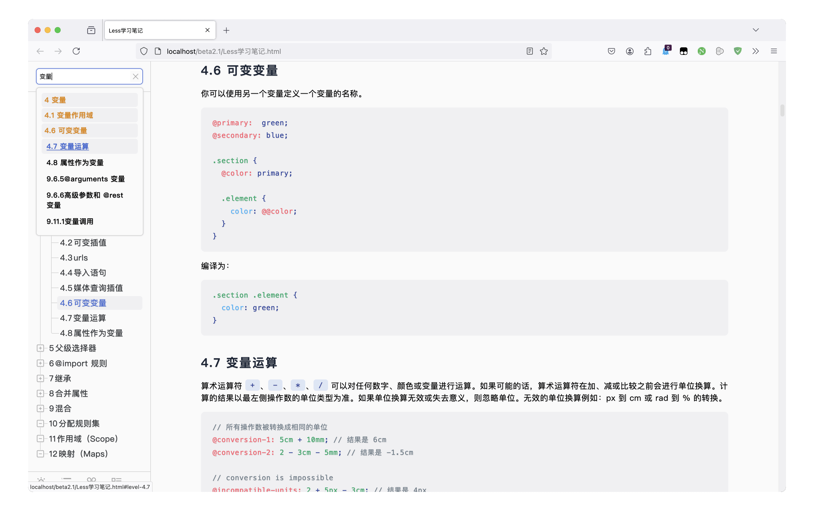

# About Mdtht

[中文文档](./readme.zh.md)

**Mdtht**（Markdown to Html Theme） is a plugin developed for Markdown editors using JavaScript and CSS. The purpose is to automatically generate side directories and document styles when exporting. md files as HTML files or previewing them.

Can be used in any Markdown editor that supports adding JavaScript and CSS, such as:：**Typora**、**MarkdownPad** ......

> [!IMPORTANT]
>
> **Note: It can also be used in a separate HTML file**. Simply introduce mdtht.min.js and mdtht.min.css into the HTML file to generate the relevant styles. As long as there is an h tag in the HTML, the corresponding directory can be generated.

> [!IMPORTANT]
>
> **Important Tips：** **Mdtht is a remake of MarkdownPad2AutoCatalog**
>
> MarkdownPad2AutoCatalog is now obsolete. Users who previously used MarkdownPad2AutoCatalog should download Mdtht again
>
> Compared to MarkdownPad2AutoCatalog, Mdtht has higher execution efficiency and richer features.

# Implemented functions

**Mdtht** provides the following features：

1. Two document style modes, high brightness and dark, can be automatically switched based on the system or manually set.
2. Automatically generate corresponding hierarchical directories and serial numbers based on the position of h1~h6 tags in the HTML document.
3. Automatically correct the directory hierarchy based on the position of the h tag
4. Automatically generate sidebar directory navigation.
5. Drag to change the width of the sidebar.
6. Show or hide title numbering.
7. Directory hierarchical tree view.
8. 3 types of directory icon styles.
9. Text Shadow Effect.
10. One click expansion of storage subdirectories.
11. One click expansion and collapse of sidebar.
12. Automatically track the directory based on the content of the reading area.
13. Catalog search.
14. Code highlighting plugin **highlightjs** style beautification，[highlightjs](https://highlightjs.org/)
15. Personalize configuration styles based on personal preferences.

# Final effect

**Light mode**

**Dark mode**

**Catalog collapse effect**

**3 types of directory styles**

**Search function effect**

# How to use it

## Use in a separate HTML file

The steps to use in a separate HTML file are as follows:

1. In the<head>tag of HTML, sequentially introduce mdtht.min.css and mdtht.min.js
2. Code highlighting (you can skip this step without code highlighting):
   1. Download highlight.min.js, [highlight.min.js download link]（ https://highlightjs.org/download ）Attention: **Please select "Select all languages" when downloading**
   2. Extract the downloaded file and refer to step 1 to import highlight.min.js into HTML.
   3. Add code after introducing highlight.min.js: `` -> Save.
3. Completed.

## Using in Typora

The steps to use in **Typora** are as follows:

1. Open `Preferences` -> `Export` -> `lick on the+button on the right` -> `Add from Template, select HTML (without Styles)` -> `Add` -> `Modify the template name just added, for example: Mdtht`
2. Click on the added template Mdtht -> `In the<head/>text box`  -> `Input:` -> Copy the **mdtht.min.css** code from the dist folder to the ``
3. `In the<body/>text box`  -> `Input:` -> Copy the **mdtht.min.js** code from the dist folder to the ``
4. The style file has been added.
5. Code highlight:
    1. Download **highlight.min.js**，[highlight.min.js-download address](https://highlightjs.org/download)，**Attention: Please select "Select all languages" when downloading**
    2. Extract downloaded files, Refer to step 3 to copy the highlight.js code into the text box of the`<body/>`
    3. **Add code at the end of the highlight.min.js code: `hljs.highlightAll();`** -> `Save completed`
6. When exporting HTML, simply select the Mdtht template you just added.

## Using in MarkdownPad

The steps to use in **MarkdownPad** are as follows:

1. Copy the code of **mdtht.min.css** from the dist folder.

2. Open MarkdownPad -> `Tool`  -> `Option`  -> `Style sheet` -> `Add`

3. Paste the code for  **mdtht.min.css** -> Give the style sheet a name that ends in '.css' -> `Save and Close`

4. Copy the code of **mdtht.min.js** from the dist folder.。

5. Open MarkdownPad -> `Tool`  -> `Option`  -> `Senior` -> `Html Head Editor`  -> Enter the label pairs in the code editor，Then paste the code of **mdtht.min.js** into the label pair, For example: ``  -> `Save and Close`

6. Code highlight:
    1. Download **highlight.min.js**，[highlight.min.js-download address](https://highlightjs.org/download)，**Attention: Please select "Select all languages" when downloading**
    2. Extract downloaded files, Refer to step 5 to copy the highlight.js code into a new `<script>` tag pair.
    3.  **Add code at the end of the highlight.min.js code: `hljs.highlightAll();`** -> `Save completed`
7. Save and close, complete.

## Using in other Markdown editors

**As long as the Markdown editor used supports adding JavaScript and CSS**，It can be used. How to add it specifically, please configure it according to your own editor.

**The core is to add JavaScript and CSS to the exported HTML file**，You can even import mdtht.min.css and mdtht.min.js directly into existing HTML files for use.

# How to customize initialization configuration

### Description of initialization parameters

| order | parameter            |  type   | Default value | describe                                                                                                               |
|:-----:| :-------------- | :-----: | :----: |:-----------------------------------------------------------------------------------------------------------------------|
|   1   | indexStyle      | Number  |   1    | Directory style, **This value only has three options: 1, 2, 3**, default style 1                                       |
|   2   | firstTagToTitle | Boolean | fasle  | Do you want to use the first title as the document title, not included in the table of contents, and default to closed |
|   3   | titleCenter     | Boolean |  true  | Is the article title centered，**This option is only valid when firstTagToTitle is true**                               |
|   4   | showIndex       | Boolean | false  | Do you want to display the catalog index |
|   5   | showTitleIndex  | Boolean | false  | Do you want to enable the title sequence of the main text                                                              |
|   6   | showTree        | Boolean |  true  | Is the directory hierarchy tree line enabled                                                                           |
|   7   | openShadow      | Boolean | false  | Is text shading enabled                                                                                                |
|   8   | openDark        | Boolean | fasle  | Whether to enable dark mode, false for day mode, true for dark mode，**This option has lower priority than system mode, but can still be manually switched**                           |

### Custom initialization settings

If you want to initialize relevant styles according to personal preferences, please follow the following steps:

1. Open mdtht.min.js.

2. Find at the end of the code: `new Mdtht`

3. If configured as: **Table of Contents Style 2，Use the first title as the document title，Centered article title**, Configure as： `new Mdtht(2,true,true)`

4. Save Exit.

Example of configuration parameter sequence:

`new Mdtht(indexStyle, firstTagToTitle, titleCenter, showIndex, showTitleIndex, showTree, openShadow, openDark);`

> [!ImPORTANT]
>
> **Be Careful：**If you want to configure the Nth parameter, the parameters before the Nth parameter must also be configured in sequence. If you want to configure the third parameter, the first and second parameters must also be configured.

---

🐳 If you like the style of this document, please provide a star 😄，If there are any issues during use, please submit them in a timely manner.
