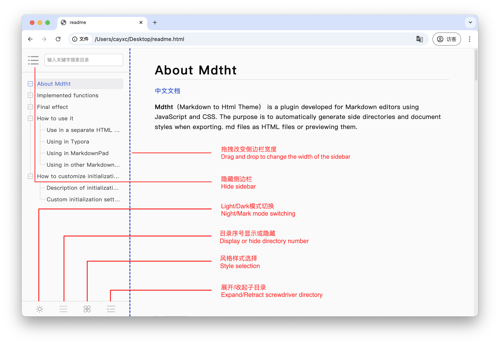
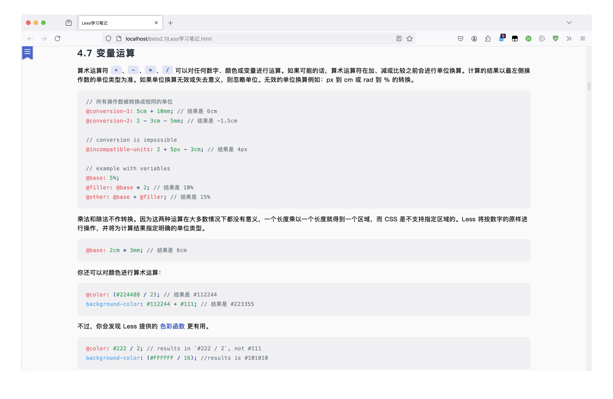

# 关于Mdtht

[English Document](./readme.md)

**Mdtht**（Markdown to Html Theme）是使用 Javascript 和 CSS 为 Markdown编辑器开发的一款插件。目的是在将 .md 文件导出为html文件或预览时，自动生成侧边目录、文档样式。

可以在任何支持添加 js 和 css 的Markdown编辑器中使用，如：**Typora**、**MarkdownPad** ......

> [!IMPORTANT]
>
> **注意：在单独的 html 文件中使用也可以**，只需在html文件中引入 mdtht.min.js和 mdtht.min.css 就能生成相关样式，只要html中有 h标签 就能生成相应的目录。

> [!IMPORTANT]
>
> **注意：** **Mdtht 是 MarkdownPad2AutoCatalog 的重制版**
>
> MarkdownPad2AutoCatalog 现在已经废弃，请之前使用MarkdownPad2AutoCatalog 的用户重新下载 Mdtht
>
> **Mdtht** 相比 **MarkdownPad2AutoCatalog** 具有更加高的执行效率和更加丰富的功能。

# 实现的功能

**Mdtht**提供了如下功能：

1. 高亮和暗黑两种文档风格模式（根据系统自动切换，也可手动设置）
2. 根据 html 文档中 h1~h6 标签的位置自动生成对应层级的目录和序号
3. 根据 h 标签的位置自动纠正目录所属层级
4. 自动生成侧边栏目录导航
5. 拖动改变侧边栏宽度
6. 标题序号显示或隐藏
7. 目录层级树状图
8. 三种目录图标样式
9. 文字阴影效果
10. 一键展开收起子目录
11. 一键展开收起侧边栏
12. 根据阅读区内容自动追踪所在目录
13. 目录搜索
14. 代码高亮插件 highlightjs 样式美化，[highlightjs网址](https://highlightjs.org/)
15. 根据个人喜好个性化配置样式

# 最终效果

**亮色模式**

**暗色模式**

**目录收起效果**

**3 种目录样式及隐藏目录编号**

**搜索功能效果**

# 字体选择建议

为了获取较好的文字和代码显示效果，建议在电脑上安装 `PingFang字体` 和 `monospace字体`。

本主题文字默认字体为 PingFang 字体，代码默认字体为 monospace 字体。提示：Mac 上已自带这两种字体，无需额外安装。

# 如何使用

## 在单独的html文件中使用

在**单独的html文件**中使用步骤如下：

1. 在 html 的 `<head>`标签中依次引入 mdtht.min.css、 mdtht.min.js
2. 代码高亮（不需要代码高亮可以跳过这步）：
    1. 下载 highlight.min.js，[highlight.min.js下载地址](https://highlightjs.org/download)，**注意：下载时请选择 “Select all languages”**
    2. 解压下载的文件，参照第 1 步将 highlight.min.js 引入到html中。
    3. 在引入的 highlight.min.js之后添加代码： `` -> `保存`。
3. 完成。

## 在Typora中使用

在**Typora**中使用步骤如下：

1. 打开 `偏好设置` -> `导出` -> `点击右侧的 + 按钮` -> `从模版添加，选择HTML(without Styles)` -> `添加` -> `修改刚才添加的模版名称，如：Mdtht`
2. 点击添加的模版 Mdtht -> `在<head/>文本框中`  -> `输入：` -> 复制 dist 文件夹中的 **mdtht.min.css** 代码到 ``
3. `在<body/>文本框中`  -> `输入：` -> 复制 dist 文件夹中的 **mdtht.min.js** 的代码到``
4. 样式文件添加完成。
5. 代码高亮：
    1. 下载 highlight.min.js，[highlight.min.js下载地址](https://highlightjs.org/download)，**注意：下载时请选择 “Select all languages”**
    2. 解压下载的文件，参照第 3 步将 highlight.min.js 代码复制到 `<body/>文本框中`
    3. **在 highlight.min.js 代码的最后位置添加代码： `hljs.highlightAll();`** -> `保存完成`。
6. 导出 html 时选择刚刚添加的 Mdtht 模版即可。

## 在MarkdownPad中使用

在**MarkdownPad**中使用步骤如下：

1. 复制 dist 文件夹中的 **mdtht.min.css** 的代码。

2. 打开 MarkdownPad -> `工具`  -> `选项`  -> `样式表` -> `添加`

3. 粘贴 **mdtht.min.css** 的代码 -> 给样式表取一个以.css结尾的名字 -> `保存并关闭`

4. 复制 dist 文件夹中的 **mdtht.min.js** 的代码。

5. 打开 MarkdownPad -> `工具`  -> `选项`  -> `高级` -> `Html Head编辑器`  -> 在代码编辑器中输入 `` 标签对，然后粘贴 **mdtht.min.js** 的代码到标签对中： ``  -> `保存并关闭`

6. 代码高亮：
    1. 下载 highlight.min.js，[highlight.min.js下载地址](https://highlightjs.org/download)，**注意：下载时请选择 “Select all languages”**
    2. 解压下载的文件，参照第 5 步将 highlight.min.js 代码复制到 `新的<script>标签对中`
    3. **在 highlight.min.js 代码的最后位置添加代码： `hljs.highlightAll();`** -> 保存。

7. 保存并关闭，完成。

## 在其他编辑器中使用

**只要所用的 Markdown 编辑器支持添加 js 和 css**，就可以使用。具体如何添加，请按照自己用的编辑器配置。

**核心就是添加js和css到导出的html文件中**，甚至可以直接在已有的 html 文件中导入mdtht.min.css和mdtht.min.js使用。

# 如何自定义初始化配置

### 初始化参数说明

| 参数顺序 | 参数            |  类型   | 默认值 | 说明                                                         |
| :------: | :-------------- | :-----: | :----: | :----------------------------------------------------------- |
|    1     | indexStyle      | Number  |   1    | 目录样式，**该值只有：1，2，3** 三个选项，默认样式 1         |
|    2     | firstTagToTitle | Boolean | fasle  | 是否将第一个标题作为文档标题，不计入目录中，默认关闭         |
|    3     | titleCenter     | Boolean |  true  | 文章标题是否居中，**该选项只有 firstTagToTitle 为 true 时才有效** |
|    4     | showIndex       | Boolean | false  | 是否显示目录编号，默认显示目录编号                           |
|    5     | showTitleIndex  | Boolean | false  | 是否开启正文标题序号，默认关闭                               |
|    6     | showTree        | Boolean |  true  | 是否开启目录层级树状线，默认开启                             |
|    7     | openShadow      | Boolean | false  | 是否开启文字阴影，默认关闭                                   |
|    8     | openDark        | Boolean | fasle  | 是否开启为黑夜模式，false 为白天模式，true 为黑夜模式，**该选项优先级低于系统模式，但仍可手动切换** |

### 自定义初始化设置

如果你想根据个人喜好初始化相关样式，请按照下面的步骤：

1. 打开 mdtht.min.js

2. 在代码最后处找到: `new Mdtht`

3. 开始配置，如配置为**目录样式2，将第一个标题作为文档标题，文章标题居中，则配置为：** `new Mdtht(2,true,true)`

4. 保存退出。

配置参数顺序示例：

`new Mdtht(indexStyle, firstTagToTitle, titleCenter, showIndex, showTitleIndex, showTree, openShadow, openDark);`

> [!ImPORTANT]
>
> **注意：**如果要配置第 N 个参数，则第 N 个之前的参数也要依次配置，如要配置第3个参数则第1、第2个参数也要配置。

---

🐳 如果您喜欢该文档样式风格，还请给一个 star 😄，使用过程中有什么问题请及时提交 issues。
